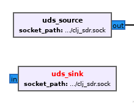

# Gnu radio UDS (Unix Domain Sockets) blocks

Very hacky implementation of UDS support for gnu radio.

This is just a quick hack that worked for one of my projects.

Provides [uds_sink](python/udsio/uds_sink.py) and [uds_source](python/udsio/uds_source.py) which are Unix Domain Sockets
clients with configurable paths. As soon as they connect they will send a byte (0x01 sink) or (0x02 source). This is a crude
initialization mechanism so a single socket server can receive two connections and know which one it can use to send or receive data from
gnu radio.

